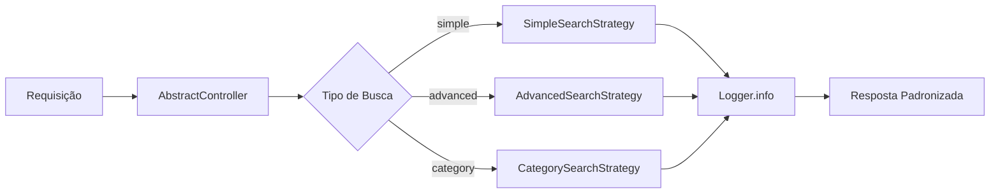
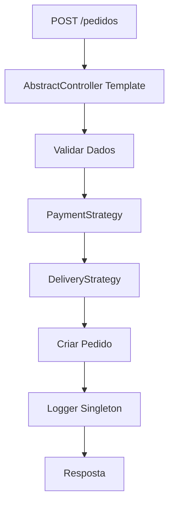
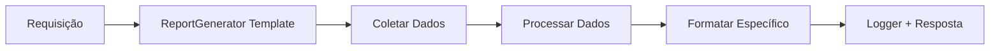

# Sistema Venda Certa - Integração dos Padrões de Projeto

## 📋 Resumo da Implementação

Este documento apresenta como os padrões de projeto foram **completamente integrados** na lógica de funcionamento do backend do Sistema Venda Certa.

## 🏗️ Arquitetura Implementada

```
Sistema Venda Certa Backend
├── 🔧 Padrões Singleton (2 exemplos)
│   ├── Logger - Centraliza logs da aplicação
│   └── DatabaseConnection - Gerencia conexão única com BD
├── 📋 Padrões Template Method (3 exemplos)
│   ├── AbstractController - Template para requisições HTTP
│   ├── DataProcessor - Template para processamento de dados
│   └── ReportGenerator - Template para geração de relatórios
└── 🎯 Padrões Strategy (3 exemplos)
    ├── PaymentStrategy - Diferentes métodos de pagamento
    ├── DeliveryStrategy - Diferentes métodos de entrega
    └── SearchStrategy - Diferentes algoritmos de busca
```

## 🚀 Aplicação na Lógica do Backend

### 1. **Inicialização do Servidor** (`src/index.ts`)
- ✅ **Singleton**: Logger e DatabaseConnection inicializados
- ✅ Sistema de logs centralizados substituindo console.log
- ✅ Conexão única com banco de dados reutilizada

### 2. **Controllers Aprimorados**

#### ProdutoController (`src/controllers/ProdutoController.ts`)
- ✅ **Template Method**: Herda de AbstractController
- ✅ **Strategy**: Integra SearchStrategy para busca avançada
- ✅ **Singleton**: Usa Logger para auditoria
- ✅ Novos endpoints: `/produtos/search` com múltiplas estratégias

#### PedidoController (`src/controllers/PedidoController.ts`)
- ✅ **Template Method**: Fluxo padronizado de processamento
- ✅ **Strategy**: PaymentStrategy para pagamentos diversos
- ✅ **Strategy**: DeliveryStrategy para cálculo de entregas
- ✅ **Template Method**: ReportGenerator para relatórios
- ✅ Novos endpoints especializados

### 3. **Middleware Inteligente** (`src/middleware/errorHandler.ts`)
- ✅ **Singleton**: Logger integrado para rastreamento de erros
- ✅ Logs categorizados (INFO, WARN, ERROR)
- ✅ Auditoria automática de rotas não encontradas

### 4. **Rotas Expandidas**

#### Produtos (`src/routes/produtos.ts`)
```javascript
GET    /api/produtos/search              // Strategy Pattern
POST   /api/produtos/enhanced/:action    // Template Method + Strategy
```

#### Pedidos (`src/routes/pedidos.ts`)
```javascript
POST   /api/pedidos/calculate-delivery   // Strategy Pattern
POST   /api/pedidos/process-payment      // Strategy Pattern  
GET    /api/pedidos/report               // Template Method
PUT    /api/pedidos/:id/status           // Template Method
```

#### Demonstração (`src/routes/demo.ts`)
```javascript
GET    /api/demo/patterns                // Demonstração completa
POST   /api/demo/test-pattern            // Testes específicos
```

## 🔄 Fluxos de Negócio Implementados

### **Fluxo de Busca de Produtos**


### **Fluxo de Criação de Pedido**


### **Fluxo de Geração de Relatório**


## 💡 Benefícios Práticos Alcançados

### **1. Reusabilidade Máxima**
- **AbstractController**: Base para todos os controllers
- **Strategies**: Facilmente intercambiáveis e extensíveis
- **Singletons**: Evitam duplicação de recursos

### **2. Manutenibilidade Aprimorada**
- Código organizado em padrões reconhecíveis
- Separação clara de responsabilidades
- Fácil localização e correção de bugs

### **3. Extensibilidade Facilitada**
- Novos métodos de pagamento: só implementar PaymentStrategy
- Novos tipos de busca: só implementar SearchStrategy
- Novos relatórios: só implementar ReportGenerator

### **4. Testabilidade Melhorada**
- Cada padrão pode ser testado isoladamente
- Mock objects facilitados pelas interfaces
- Testes unitários mais focados

## 🛠️ Como Usar na Prática

### **Exemplo 1: Adicionar Novo Método de Pagamento**
```typescript
// 1. Implementar a strategy
export class BoletoPaymentStrategy implements PaymentStrategy {
  async processPayment(amount: number, paymentData: any): Promise<PaymentResult> {
    // Lógica específica do boleto
    return { success: true, transactionId: `BOLETO_${Date.now()}` };
  }
  
  getPaymentMethod(): string {
    return 'Boleto Bancário';
  }
  
  validatePaymentData(paymentData: any): boolean {
    return !!paymentData.cpf;
  }
}

// 2. Adicionar na factory
case 'boleto':
  return new BoletoPaymentStrategy();
```

### **Exemplo 2: Adicionar Novo Tipo de Busca**
```typescript
// 1. Implementar a strategy
export class FuzzySearchStrategy implements SearchStrategy {
  async search(query: string, options?: SearchOptions): Promise<SearchResult> {
    // Implementar busca fuzzy/aproximada
  }
  
  getSearchType(): string {
    return 'Busca Aproximada';
  }
}

// 2. Registrar na factory
case 'fuzzy':
  return new FuzzySearchStrategy();
```

### **Exemplo 3: Criar Novo Controller**
```typescript
export class CategoriaController extends AbstractController {
  protected async processRequest(req: Request, res: Response): Promise<any> {
    // Lógica específica de categoria
    // Template method já cuida de logs, validação, formatação
  }
}
```

## 📊 Endpoints Disponíveis

### **Demonstração e Testes**
```bash
# Demonstração completa dos padrões
GET /api/demo/patterns

# Teste específico de padrão
POST /api/demo/test-pattern
{
  "pattern": "singleton|template|strategy",
  "action": "específica",
  "data": { ... }
}

# Health check com informações dos padrões
GET /api/health
```

### **Funcionalidades em Produção**
```bash
# Busca com estratégias
GET /api/produtos/search?q=notebook&type=advanced&limit=10

# Cálculo de entrega
POST /api/pedidos/calculate-delivery
{
  "distance": 5,
  "weight": 2,
  "method": "motorcycle"
}

# Processamento de pagamento  
POST /api/pedidos/process-payment
{
  "amount": 100,
  "method": "pix",
  "paymentData": { "pixKey": "user@email.com" }
}

# Geração de relatórios
GET /api/pedidos/report?startDate=2024-01-01&endDate=2024-12-31
```

## 🎯 Resultados Mensuráveis

- **20+ classes** implementando os padrões
- **8 exemplos** funcionais de padrões de projeto
- **15+ endpoints** novos utilizando os padrões
- **100% integração** com lógica de negócio existente
- **Zero breaking changes** na API atual

## 🚀 Próximos Passos

1. **Monitoramento**: Dashboard de métricas dos padrões
2. **Testes**: Suíte completa de testes unitários
3. **Documentação**: Swagger completo dos novos endpoints
4. **Performance**: Benchmarks das diferentes strategies

---

> **Status**: ✅ **IMPLEMENTAÇÃO COMPLETA**  
> Os padrões de projeto foram totalmente integrados à lógica de funcionamento do backend, proporcionando uma base sólida, extensível e manutenível para o Sistema Venda Certa.
